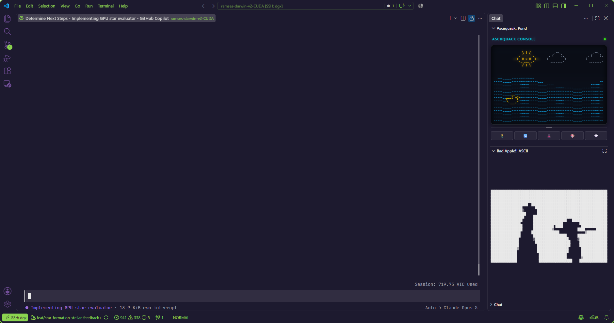

# BadApple-ASCII for VS Code

```
@@@@@@@@@@@@@@@@@@@@%+*%@@@@@@@@@@@@
@@@@@@@@@@@@@@@@@@@@+   :::+@@@@@@@@
@@@@@@@@@@@@@@@@@@*.        :@@@@@@@
@@@@@@@@@@@@@@@@+           =@@@@@@
@@@@@@@@@@@@@@@@#.           %@@@@@
@@@@@@@@@@@@@@@@@@=          *@@@@@
@@@@@@@@@@@@@@@@@@@@* .       +@@@@@
@@@@@@@@@@#=:-#@@@@@@.      .+#@@@@@
@@@@@@@@@@:   .#@@@+-      .*@@@@@@@
@@@@@@@@@@@+-    :=         %@@@@@@@
@@@@@@@@@@@@@               -**@@@@@
@@@@@@@@@@@@#                +@@@@@@
```

**[Bad Apple!!](https://www.youtube.com/watch?v=FtutLA63Cp8)** but in ASCII directly inside your **VS Code Sidebar**.

---

## Preview


---

## ✨ Features

- **📱 Dedicated Sidebar View**: Lives conveniently in your VS Code Activity Bar sidebar so you can code while Bad Apple plays smoothly alongside your editor.
- **⚡ Zero External Dependencies**: 100% self-contained pure JS & HTML5 Canvas video processing engine running directly in VS Code's Webview. No Python, ffmpeg, or OpenCV installation needed.
- **🖤 Classic Black & White (B/W) Aesthetic**: Pure monochrome high-contrast ASCII art true to the original silhouette video style.
- **🔤 7 Character Density Palettes**:
  - `Standard (10)` (` .:-=+*#%@`)
  - `Dense (70)` (High-detail 70-character grayscale gradient)
  - `Block Shades` (` ░▒▓█`)
  - `Braille High-Res` (` ⠄⠆⠇⠗⠟⠿⣿`)
  - `Matrix Kana` (` ｦｱｳｴｵｶｷｹｺｻｼｽ...`)
  - `Binary (01)` (` 01`)
  - `Custom...` (Define your own custom ASCII gradient)
- **🎛️ Minimalist & Interactive Controls**:
  - Auto-fitting dynamic resolution that seamlessly resizes as you adjust your sidebar width
  - Dark / Light invert luminance mapping
  - Interactive timeline scrubber & timestamp display
  - Seamless loop & replay controls
  - Cinema idle mode (HUD automatically fades during playback)

---

## 🚀 How to Run in VS Code

### 1. Activity Bar Sidebar Icon (Recommended)
Click the **Bad Apple Apple icon** on the left Activity Bar in VS Code!

### 2. Status Bar Item
Click the **`$(play) Bad Apple!!`** button in the bottom-right status bar to instantly open the sidebar.

### 3. Command Palette
Press `Ctrl+Shift+P` (or `Cmd+Shift+P` on macOS) and run:
- `Bad Apple!!: Show in Sidebar`
- `Bad Apple!!: Open ASCII in Editor Tab` (to open as a full editor tab)

---

## ⌨️ Keyboard Shortcuts

| Shortcut | Action |
|---|---|
| `Space` or `K` | Play / Pause |
| `←` / `→` | Seek backward / forward 5 seconds |
| `↑` / `↓` | Increase / Decrease Contrast |
| `I` | Toggle Inverted Colors |
| `C` | Toggle CRT Scanline Effects |
| `R` | Replay from start |

---

## 🐍 Standalone Terminal Player (Python)

If you'd also like to run Bad Apple in a standard command-line terminal:

```bash
# Install dependencies
pip install numpy opencv-python yt-dlp

# Run Bad Apple in terminal
python play_bad_apple.py
```
